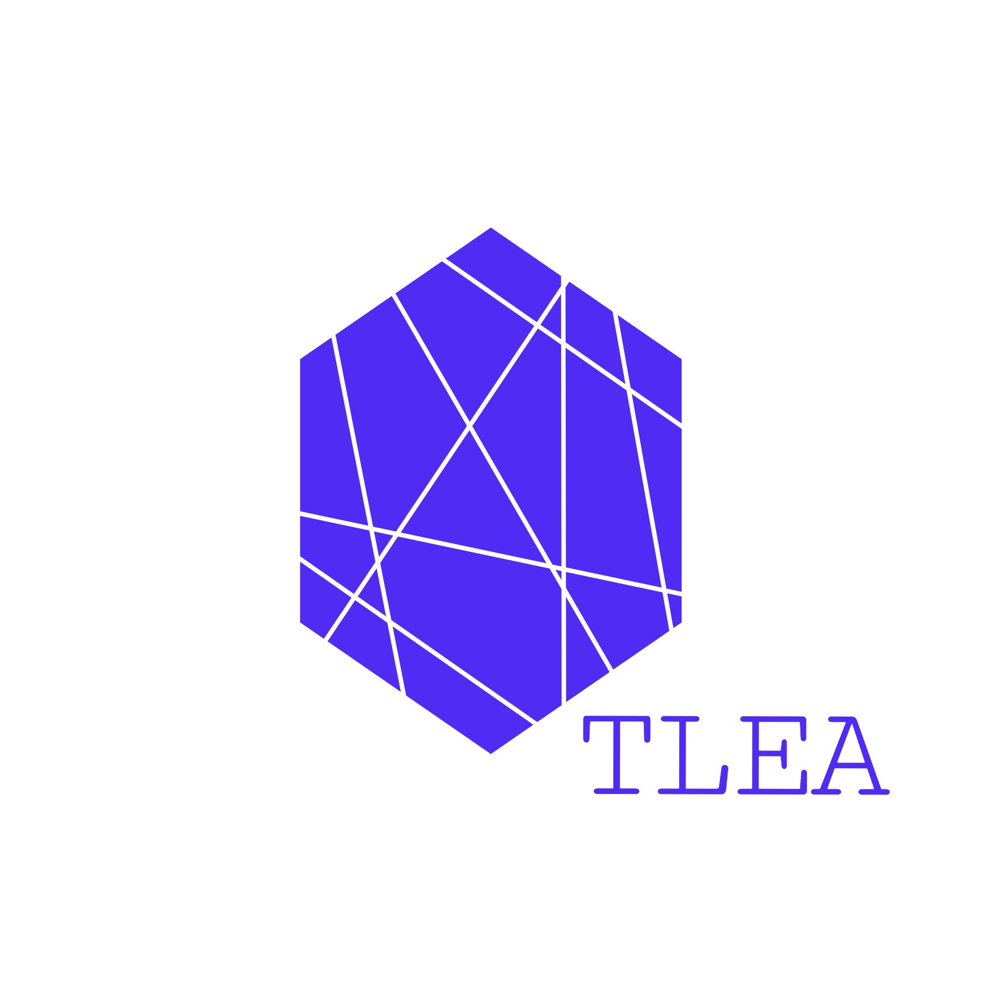

# TLEA (Totally Logical Encryption Algorithm)

As the Acronym says its a Logical (Pun found?? ) , in-progress symmetric key encryption algorithm whoes aim is to 
* be fast
* and question itself why does it exist

Reason i am making this thing :
* i love encryption and the principal behind it
* i love python
* i love to make things go fast and achive its full popential in a non-conventional method

## TODOs

- [X] make it work
- [ ] improve security (need to use chaining to avoid pattern based attack)
- [ ] make the NIM or C implementation for speed
